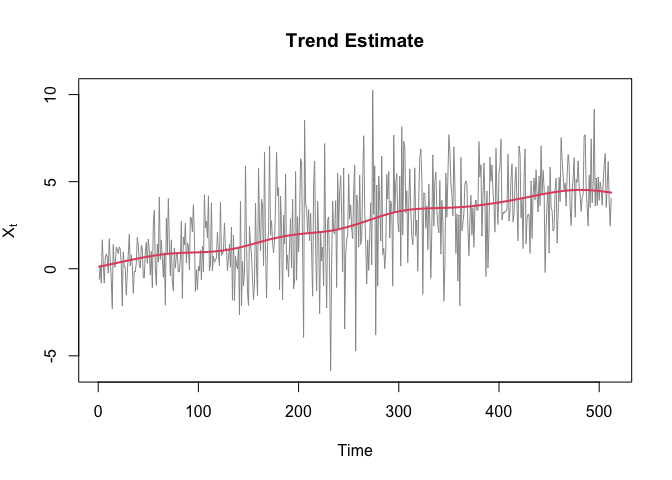
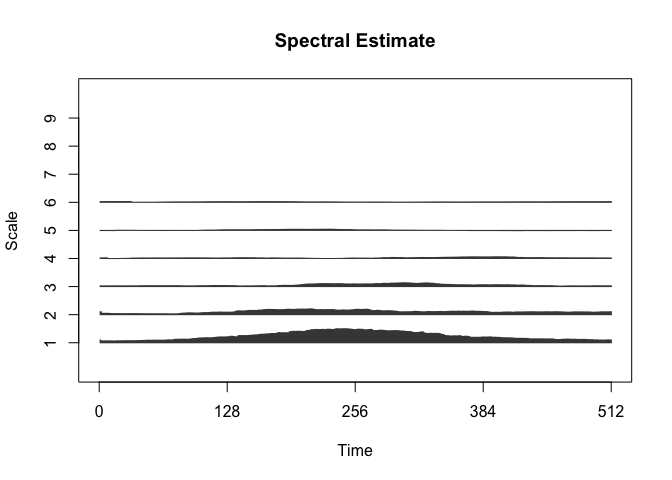

<!-- README.md is generated from README.Rmd. Please edit that file -->

# TrendLSW

<!-- badges: start -->

[](https://github.com/EuanMcGonigle/TrendLSW/actions/workflows/R-CMD-check.yaml)
[](https://app.codecov.io/gh/EuanMcGonigle/TrendLSW?branch=main)
<!-- badges: end -->

Implements wavelet methods for analysis of nonstationary time series.
See

> McGonigle, E. T., Killick, R., and Nunes, M. (2022). Trend locally
> stationary wavelet processes. *Journal of Time Series Analysis*,
> 43(6), 895-917.

> McGonigle, E. T., Killick, R., and Nunes, M. (2022). Modelling
> time-varying first and second-order structure of time series via
> wavelets and differencing. *Electronic Journal of Statistics*, 6(2),
> 4398-4448.

for full details.

## Installation

You can install the released version of `TrendLSW` from
[CRAN](https://CRAN.R-project.org) with:

    install.packages("TrendLSW")

You can install the development version of `TrendLSW` from
[GitHub](https://github.com/) with:

    devtools::install_github("https://github.com/EuanMcGonigle/TrendLSW")

## Usage

For detailed examples, see the help files within the package. We can
generate a small example for performing trend and spectrum estimation as
follows:

``` r
library(TrendLSW)

set.seed(1)

noise <- rnorm(512) * c(seq(from = 1, to = 3, length = 256), seq(from = 3, to = 1, length = 256))
trend <- seq(from = 0, to = 5, length = 512)
x <- trend + noise
```

Apply the `TLSW` function:

``` r
x.TLSW <- TLSW(x)
```

Visualise the estimated trend and spectrum:

``` r
plot(x.TLSW)
```


